# DGverse

DGverse is a 3D and VR experience utilizing Deepgram Automatic Speech Recognition (ASR).

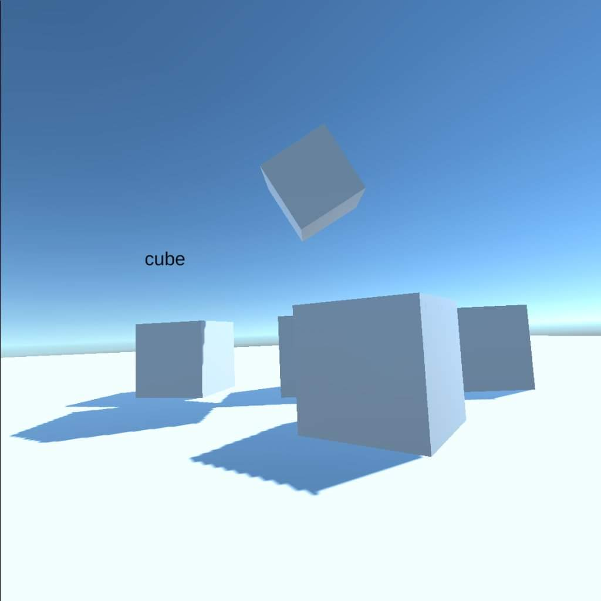

In this repository, by default, the project is set up to run without any VR plugins or VR rig. This is so that the project
can be worked on portably on any development platform (Windows, macOS, Linux).

VR support is added by converting the `Main Camera` to an `XR Rig` and performing a few additional steps,
which will be documented below. Additionally, before each release, two branches and tags will be made,
one for the 3D version of the project, and one for the VR version of the project. The VR support is only
for the Meta Quest 2 at the moment.

## Working with the project in 3D

Install Unity Editor 2021.3.3f1, preferably via Unity Hub. Include support for all platforms you are interested in
(Windows/macOS/Linux for Desktop, and Android for the Quest 2). If you are planning on building for the Quest 2
and are using Ubuntu 20.04 LTS, follow the instructions in "Setting up a working VR/Unity/Linux (Ubuntu 20.04 LTS) environment"
for installing Unity.

Now, clone this repository:

```
git clone git@github.com:deepgram-devs/DGverse.git
```

In the "Projects" tab of Unity Hub click "Open":

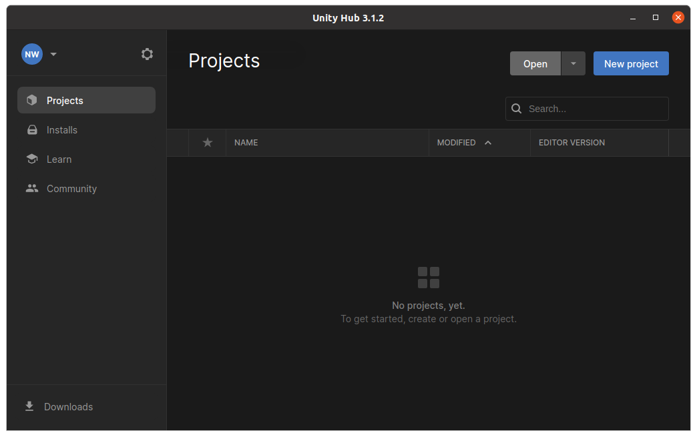

Navigate to the "DGverse" directory you just cloned and click "Open":


In the lower-left Project tab, navigate to `Assets -> Scripts`. You should see a `DeepgramInstance.cs` script in the center-bottom panel.
Open it (by double-clicking, or by using something like Script Inspector 3), and replace the text `INSERT_YOUR_DEEPGRAM_API_KEY` with your Deepgram API key.
Also in `Assets -> Scripts` open `ASRTriggerController.cs` and replace the text `INSERT_YOUR_CLEVERBOT_API_KEY` with your Cleverbot API key.

You may need to go to `Assets -> Scenes` and double click "SampleScene.unity" there to open up the main (and only) game scene.

You should now be able to press the "Play" button near the center-top of the Unity Editor!

## Setting up a working VR/Unity/Linux (Ubuntu 20.04 LTS) environment

A lot of the following is based on this guide: https://devinwillis.com/2019/11/29/oculus-quest-development-with-linux-and-unity3d/

However, that guide did not work 100% out of the box for me (though it was still extremely useful),
so this README will cover everything from start to finish.

Note that the general procedure here is to build the VR App in Unity, and copy the resulting APK file to the Quest 2 for execution and testing.
This is not an ideal solution, as it is cumbersome. However, for simple projects and slow development, this will get you going!

### Install Unity

Basically follow the instructions here: https://docs.unity3d.com/hub/manual/InstallHub.html#install-hub-linux

This means run:

```
sudo sh -c 'echo "deb https://hub.unity3d.com/linux/repos/deb stable main" > /etc/apt/sources.list.d/unityhub.list'
wget -qO - https://hub.unity3d.com/linux/keys/public | sudo apt-key add -
sudo apt update
sudo apt-get install unityhub
```

Then install the Unity Editor (version 2021.3.3f1) with Android support:

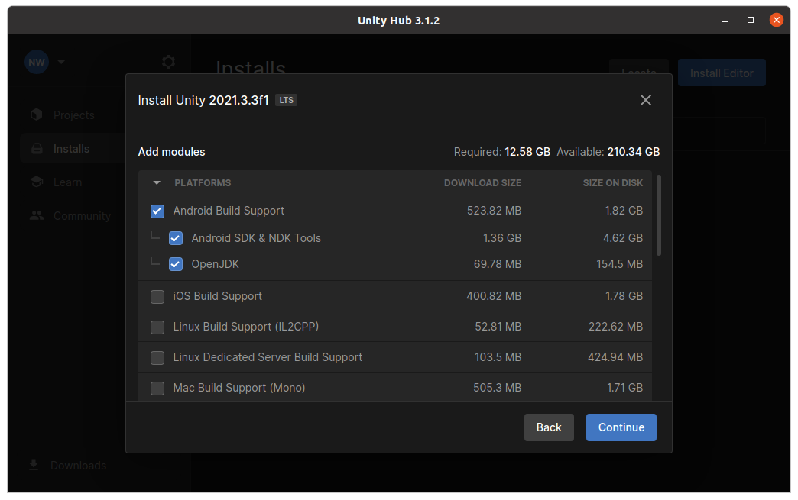

Note: we will not actually use the Unity-installed JDK or Android SDK, though we will use the Android NDK.

Then run:

```
chmod -R +x /home/YOURUSERNAME/Unity/Hub/Editor/2021.3.3f1/Editor/Data/PlaybackEngines/AndroidPlayer/NDK
```

Change `YOURUSERNAME` to your username. This step is required because things don't compile in Unity
because the various executables in the `NDK` directory and sub-directories are not executable...

### Install the JDK

```
sudo apt install openjdk-8-jdk
```

If you, at this point, have multiple OpenJDK versions installed, make sure to set the system's JDK version
to 8 using:

```
sudo update-alternatives --config java
```

### Install the Android SDK

```
wget https://dl.google.com/android/repository/sdk-tools-linux-4333796.zip
unzip sdk-tools-linux-4333796.zip -d ~/androidsdk
```

Then add the following line to your `~/.bashrc`:

```
export PATH=/home/YOURUSERNAME/androidsdk/tools/:/home/YOURUSERNAME/androidsdk/tools/bin:$PATH
```

Change `YOURUSERNAME` to your username. Then start a fresh terminal or run:

```
source ~/.bashrc
```

Then run:

```
sdkmanager --list
sdkmanager "build-tools;29.0.0"
sdkmanager "platform-tools"
```

### Change some Unity settings

Open up, or create, any project using the Unity Editor. Then go to `Edit -> Preferences` and in the "External Tools" tab, change the JDK path to:

```
/usr/lib/jvm/java-1.8.0-openjdk-amd64
```

And change the Android SDK path to:

```
/home/YOURUSERNAME/androidsdk
```

Change `YOURUSERNAME` to your username. Things should look like this:

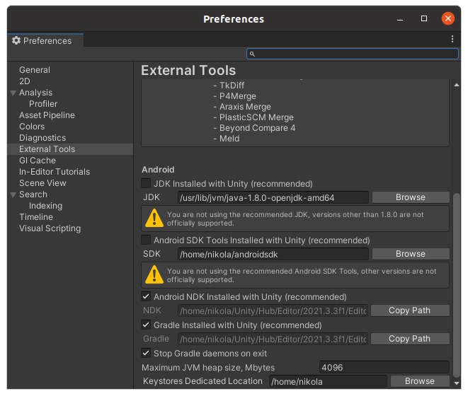

## Working with the project in VR

First, if you are using Ubuntu 20.04 LTS, follow
all of the instructions i "Setting up a working VR/Unity/Linux (Ubuntu 20.04 LTS) environment". If you are using Windows, the setup should
be much simpler, and most likely should work out of the box, but this has not been tested. Then, follow the instructions in "Working with the project in 3D"
to clone and import the project, and enter your Deepgram API key in the required place.

Now, let's add the Unity plugins we will need for VR support. With the DGverse Project open in the Unity Editor, go to
`Window -> Package Manager`. Make sure "Packages: Unity Registry" is selected from the second drop-down from the left (see screenshot below).
Find the "Oculus XR Plugin" under "VR" in the tab on the left and click "Install".

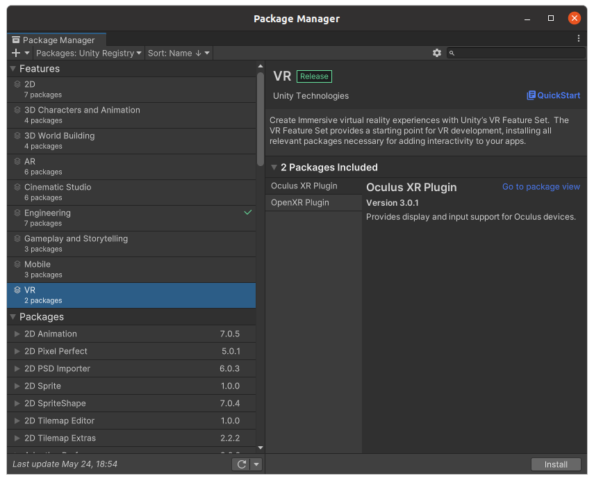

You may get the following warning, and if you do, just click "Yes":

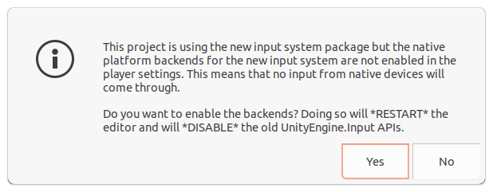

Now, go to `Edit -> Project Settings`, click on the "Android" tab (indicated by the Android icon, see screenshot below) and check the "Oculus" box.

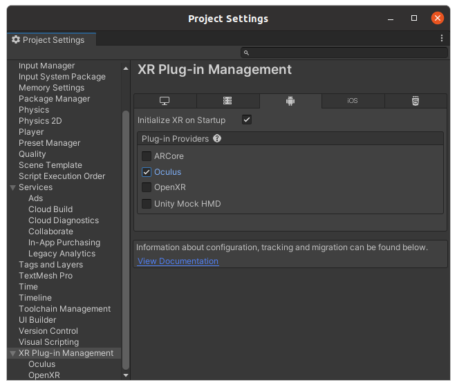

Now go to `File -> Build Settings`, click on "Android" and then "Switch Platform".

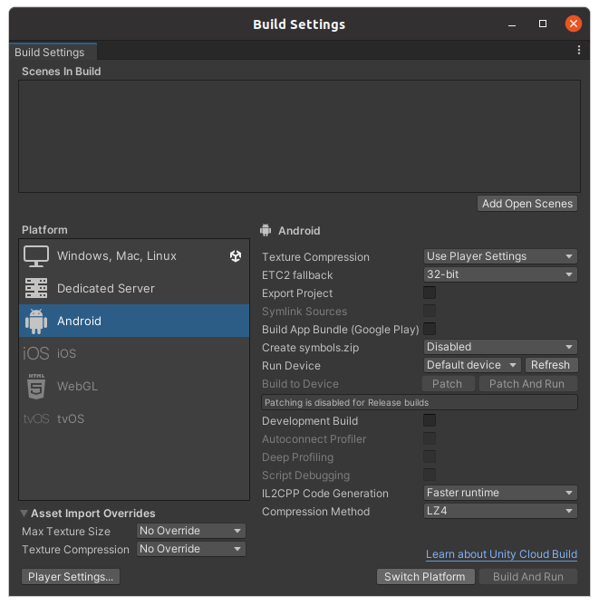

Now, we need to edit a couple objects in our Unity scene. In the "Sample Scene" on the left where the game objects are listed,
right click and select `XR -> Convert Main Camera To XR Rig`.

Then, find the "Main Camera" object under `XRRig -> Camera Offset -> Main Camera`
and remove the `CameraController3D.cs` script/component from it. Then, add a "Character Controller" component to the "XR Rig" object,
and finally attach the `CameraControllerVR.cs` script to the "XR Rig" object as a component. This is essentially removing the keyboard movement
controls and replacing them with movement controls which use the left joystick of the VR device. The mouse looking controls
aren't needed in VR as the "XRRig" object somehow uses the VR headset for tracking where you are looking.

Now, edit the `MicrophoneInstance.cs` script and look for the comments which say "CHANGE FOR 3D/VR" - these comments should tell you what lines
need to be changed. Also, modify the MicrophoneObject and add "Right Hand" to the "Right Hand Source". Do the same for `ASRTriggerController.cs`,
i.e. look for comments which say "CHANGE FOR 3D/VR" and follow the instructions.

Finally, go back to `File -> Build Settings`, click "Build", and give a name to the APK file you are about to build.
You may get some (two?) warnings/notifications to upgrade the Android SDK - click "Update Android SDK" in all (both?) cases:


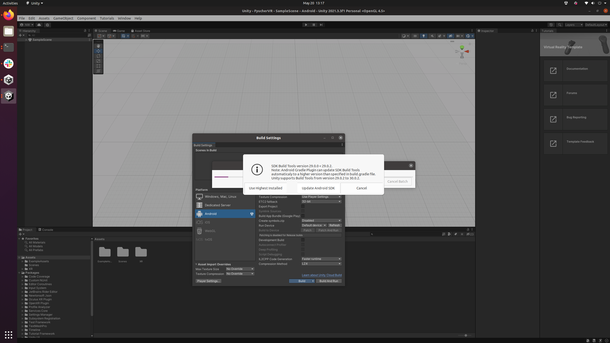

You should only have to do this once on your system.

That should be it! You now have an APK that can be loaded onto a Quest 2. Instructions for how to do this
are in the section "Installing the APK on the Quest 2 Using SideQuest".

## Installing the APK on the Quest 2 Using SideQuest

The instructions for this section were taken from my exploratory project, FyucherVR (https://github.com/nikolawhallon/FyucherVR).
As such, some screenshots may reference "FyucherVR" instead of "DGverse".

Download SideQuest from the following URL: https://sidequestvr.com/setup-howto

Plug your Quest 2 into your computer with a USB-C cable, and open SideQuest (on Linux/Ubuntu, the SideQuest download provides a simple executable to run, so
there are no extra installation instructions here). You will probably be greeted by a warning/error about ADB udev rules:

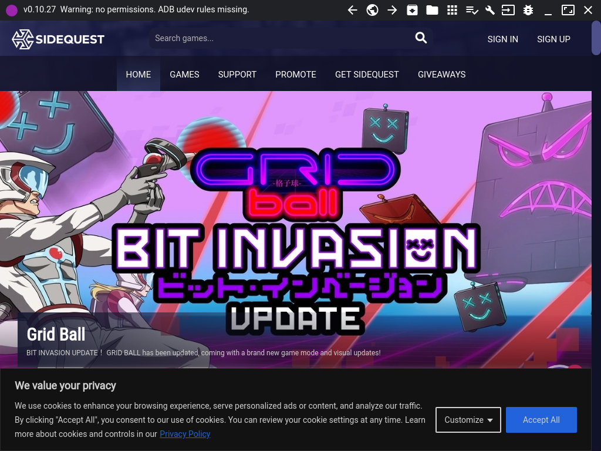

In a terminal run `lsusb` to identify the Quest 2 device. When I ran this, I found it in the output as:

```
Bus 002 Device 002: ID 2833:0186 Oculus Quest 2
```

Edit the following file:

```
sudo nano /etc/udev/rules.d/51-android.rules
```

And give it the following contents:

```
SUBSYSTEM=="usb", ATTR{idVendor}=="2833", ATTR{idProduct}=="0186", MODE="0666", GROUP="plugdev"
```

Make sure the `idVendor` and `idProduct` numbers match what `lsusb` stated for your Quest 2 (so for me these were "2833" and "0186", respectively).

Now when you look at SideQuest, you should see the following warning:

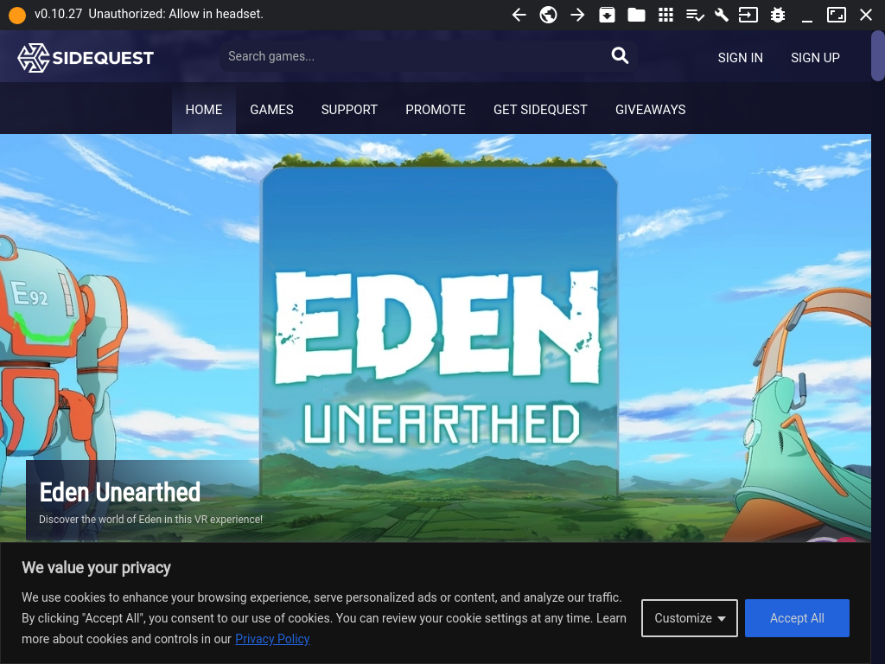

As suggested, now put on your Quest 2 headset and you will see some prompt asking you to allow the computer access to the headset - click "Allow".

Finally, in SideQuest, you should see some green dot in the upper left corner, indicating your computer is successfully connected to the Quest 2!
Now on the top bar of SideQuest, click on the icon with the arrow to the left of the "folder icon" to "Install APK file from folder on computer.":

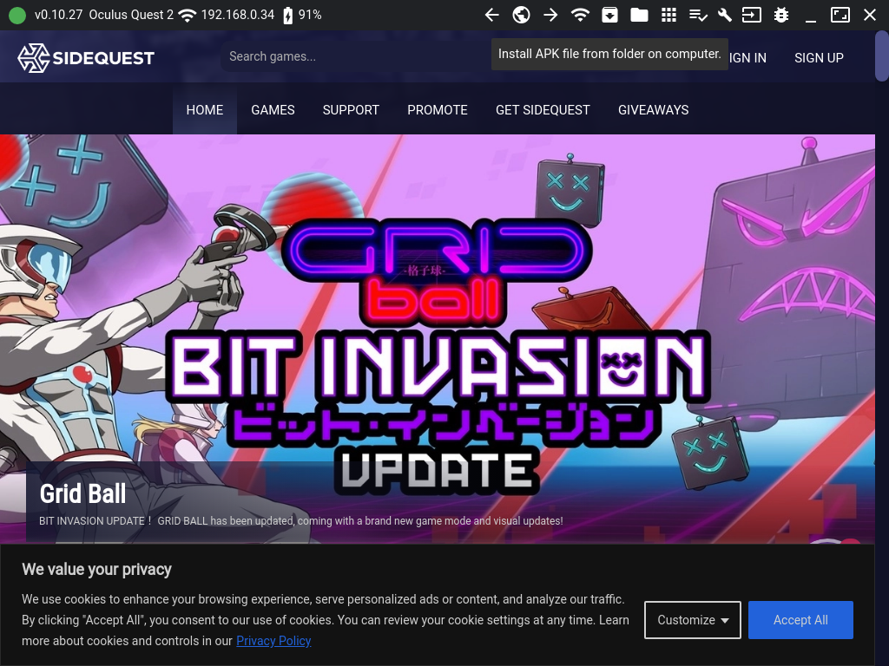

If this was successful, you should see it if you click on the "tasks icon" in the top bar of SideQuest:

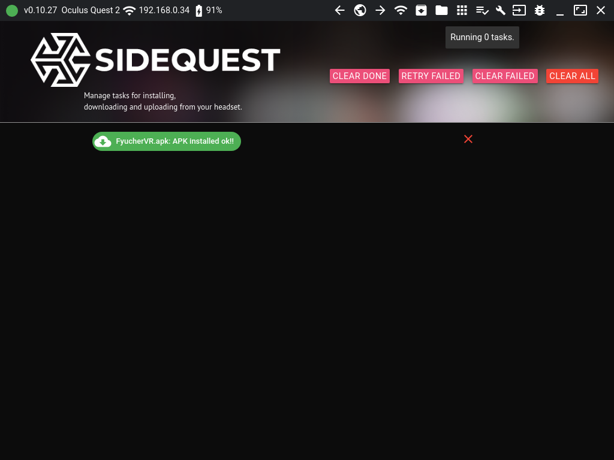

You should now have the APK installed on your Quest 2! However, to access it, you will have to navigate to "Unknown Sources" on the Quest 2.
I will try to write up how to do this after I figure out how to take screenshots on the Quest 2. In the meantime, there are plenty of guides
on Google, and I actually found it by clicking in random menus until I figured it out!
