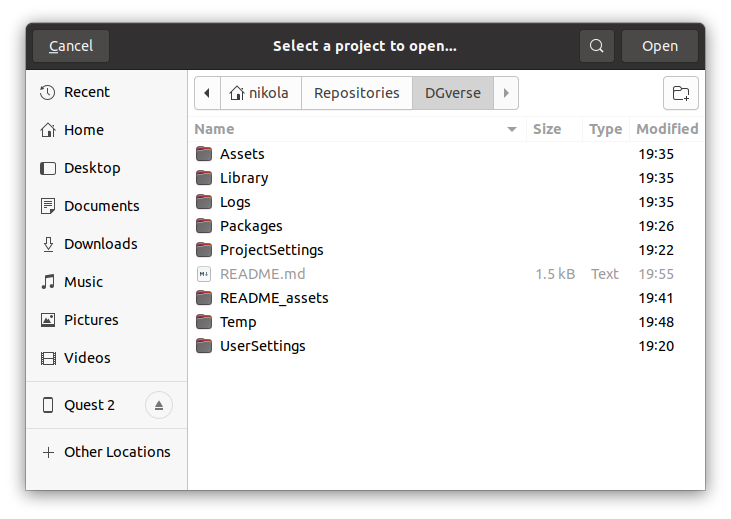

# DGverse

DGverse is a 3D and VR experience utilizing Deepgram Automatic Speech Recognition (ASR).

In this repository, by default, the project is set up to run without any VR plugins or VR rig. This is so that the project
can be worked on portably on any development platform (Windows, macOS, Linux).

VR support is added by converting the `Main Camera` to an `XR Rig` and performing a few additional steps,
which will be documented below. Additionally, before each release, two branches and tags will be made,
one for the 3D version of the project, and one for the VR version of the project.

## Working with the project in 3D

Install Unity Editor 2021.3.3f1, preferably via Unity Hub. Then clone this repository:

```
git clone git@github.com:deepgram-devs/DGverse.git
```

In the "Projects" tab of Unity Hub click "Open":


Navigate to the "DGverse" directory you just cloned and click "Open":



In the lower-left Project tab, navigate to `Assets -> Scripts`. You should see a `DeepgramInstance.cs` script in the center-bottom panel.
Open it (by double-clicking, or by using something like Script Inspector 3), and replace the text `INSERT_YOUR_API_KEY` with your Deepgram API key.

You should now be able to press the "Play" button near the center-top of the Unity Editor!

## Working with the project in VR

To be written.
